> **Percepción** **3D** **PRACTICA** **1**
>
> **PREPROCESAMIENTO** **Y** **SEGMENTACIÓN** **DE** **NUBES** **DE**
> **PUNTOS**

José Carlos Castillo **Arturo** **de** **la** **Escalera**

> 2022/2023
>
>  style="width:1.60157in;height:0.51457in" />**índice**

**Leer** **y** **escribir** **nubes** **de** **puntos** **Mallas**

**Preprocesamiento** **Encontrar** **un** **plano**

**Funciones** **para** **encontrar** **objetos** **Segmentación**
**por** **distancia**

> Arturo de la Escalera Percepción 3D 2
>
>  style="width:1.60157in;height:0.51457in" />**Leer** **y** **escribir**
> **nubes** **de** **puntos**

**pcread**

Leer una nube de puntos 3-D desde un fichero en formato PLY o PCD
**pcwrite**

> Escribir una nube de puntos 3-D desde un fichero en formato PLY o PCD

**pcfromkinect**

Leer una nube de puntos 3-D desde una Kinect para Windows
**velodyneFileReader**

> Leer una nube de puntos 3-D desde un fichero en formato Velodyne PCAP
>
> Arturo de la Escalera Percepción 3D 3
>
>  style="width:1.60157in;height:0.51457in" />**Formatos** **de**
> **ficheros**

**Formato** **“Polygon** **file”** **o** **“Stanford** **triangle”**
**(PLY)** Los objetos se describen como polígonos.

> El fichero tiene una cabecera seguida de la lista de vértices y de
> polígonos.
>
> En la cabecera se especifica: número de vértices y polígonos y la
> propiedades de los vértices: coordenadas (x,y,z), normales, y color

**Formato** **“point** **cloud** **data”** **(PCD)**

> Desarrollado para la biblioteca de funciones Point cloud library (PCL)
>
> Arturo de la Escalera Percepción 3D 4
>
>  style="width:1.60157in;height:0.51457in" />**Cargar** **archivo**
> **y** **ver** **por** **pantalla**

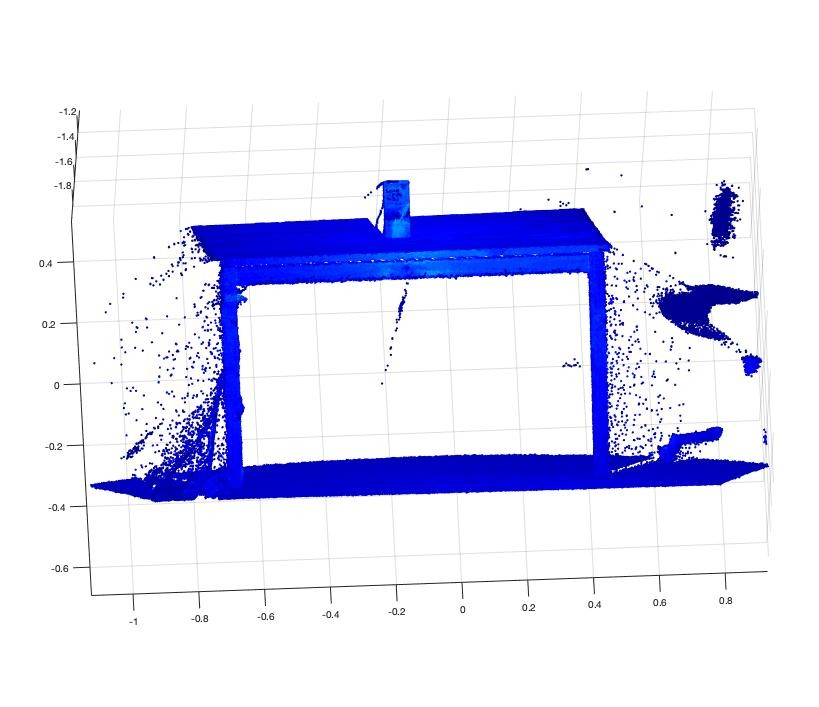**1.** **ptCloud** **=**
**pcread('mesa.ply');** **2.** **pcshow(ptCloud);**

> Arturo de la Escalera Percepción 3D 5
>
>  style="width:1.60157in;height:0.51457in" />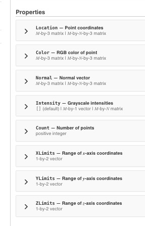 style="width:3.58897in;height:5.58976in" />**Propiedades** **de**
> **una** **nube** **de** **puntos**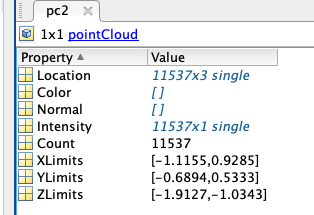 style="width:4.36062in;height:2.98583in" />

Arturo de la Escalera Percepción 3D 6

>  style="width:1.60157in;height:0.51457in" />**índice**

**Leer** **y** **escribir** **nubes** **de** **puntos** **Mallas**

**Preprocesamiento** **Encontrar** **un** **plano**

**Funciones** **para** **encontrar** **objetos** **Segmentación**
**por** **distancia**

> Arturo de la Escalera Percepción 3D 7
>
>  style="width:1.60157in;height:0.51457in" />**Mallas**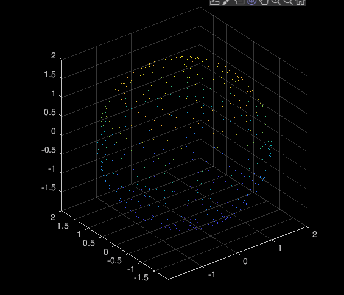 style="width:4.35669in;height:3.73976in" />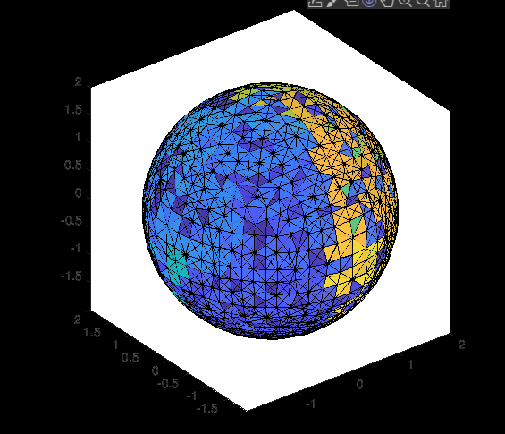 style="width:4.35669in;height:3.73976in" />

**\>\>** **pc=pcread("esfera_ds.ply");**

**\>\>** **malla=delaunayTriangulation(pc.Location);** **\>\>**
**tetramesh(malla);**

> Arturo de la Escalera Percepción 3D 8
>
>  style="width:1.60157in;height:0.51457in" />**índice**

**Leer** **y** **escribir** **nubes** **de** **puntos** **Mallas**

**Preprocesamiento** Restringir el rango

> Variar la resolución de la nube de puntos Filtrado de puntos aislados

Obtener la normal a un punto **Encontrar** **un** **plano**

**Funciones** **para** **encontrar** **objetos** **Segmentación**
**por** **distancia**

> Arturo de la Escalera Percepción 3D 9
>
>  style="width:1.60157in;height:0.51457in" />**Restringir** **el**
> **rango**

**indices** **=** **findPointsInROI(ptCloud,roi)**
pc=pcread('mesa.ply');

> 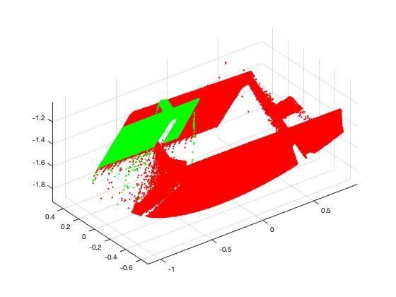 style="width:4.93858in;height:3.70393in" />roi =\[
> -1,0;-0.2,0.4;-1.8,-1.2\]; indices = findPointsInROI(pc, roi); pc2 =
> select(pc,indices); pcshow(pc.Location,'r');
>
> hold on; pcshow(pc2.Location,'g'); hold off;
>
> Arturo de la Escalera Percepción 3D 10
>
>  style="width:1.60157in;height:0.51457in" />**Variar** **la**
> **resolución** **de** **la** **nube** **de** **puntos**

**pcdownsample(ptCloudIn,'random',percentage)**

**pcdownsample(ptCloudIn,'gridAverage',gridStep)**

**pcdownsample(ptCloudIn,'nonuniformGridSample',** **maxNumPoints)**

> maxNumPoints al menos 6
>
> Arturo de la Escalera Percepción 3D 11
>
>  style="width:1.60157in;height:0.51457in" />**Variar** **la**
> **resolución** **de** **la** **nube** **de** **puntos**
>
> 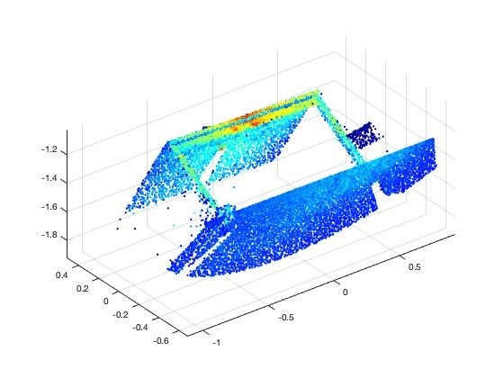 style="width:3.93661in;height:2.95236in" />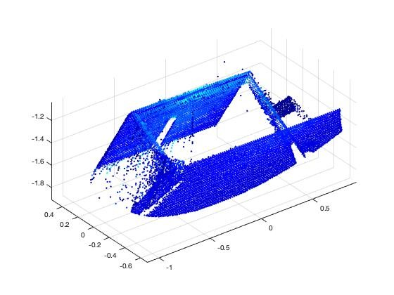 style="width:3.93661in;height:2.95236in" />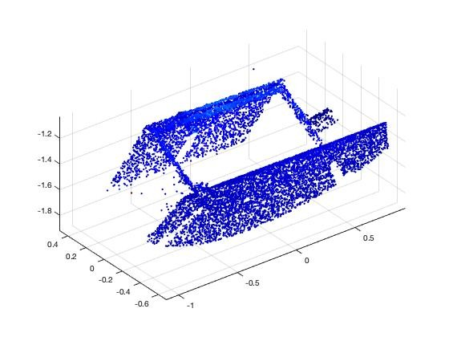 style="width:3.93661in;height:2.95236in" />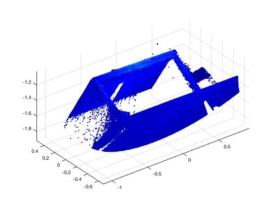 style="width:3.93661in;height:2.95236in" />gridAverage
>
> random

Arturo de la Escalera

nonuniformGridSample

> Percepción 3D 12
>
>  style="width:1.60157in;height:0.51457in" />**Variar** **la**
> **resolución** **de** **la** **nube** **de** **puntos**

**gridStep** **=** **0.05;**

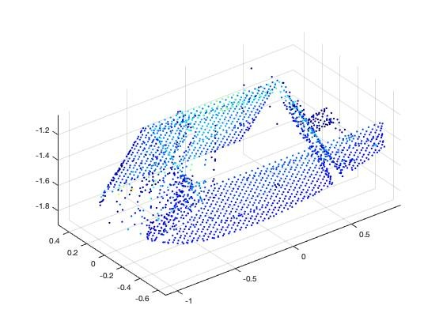**pc2=**
**pcdownsample(pc,'gridAverage',gridStep);** **pcshow(pc2);**

> Arturo de la Escalera Percepción 3D 13
>
>  style="width:1.60157in;height:0.51457in" />**Eliminar** **“outliers”**

**ptCloudOut** **=** **pcdenoise(ptCloudIn)**

> Estima la media de la distancia a los k-vecinos más próximos y si es
> mayor que un valor elimina el punto
>
> NumNeighbors por defecto 4
>
> *Threshold* por defecto: 1 desviación típica de la media de todas las
> distancias

**\[ptCloudOut,inlierIndices,outlierIndices\]** **=**
**pcdenoise(ptCloudIn)**

**ptCloudOut** **=** **pcdenoise(ptCloudIn,**
**'Threshold’,TValor,'NumNeighbors’,Nvalor)**

> Arturo de la Escalera Percepción 3D 14
>
>  style="width:1.60157in;height:0.51457in" />**Eliminar** **“outliers”**
>
> 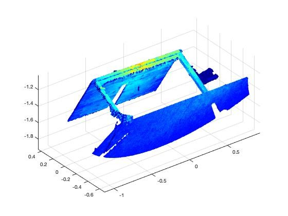 style="width:4.19921in;height:3.14921in" />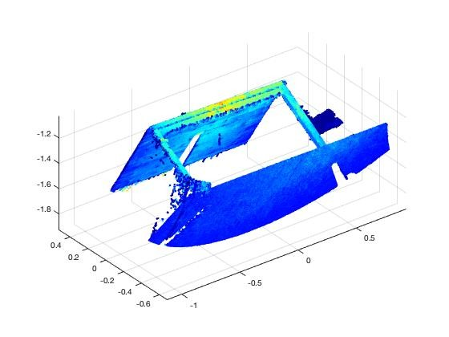 style="width:4.19921in;height:3.14921in" />pc2 = pcdenoise(pc);
>
>  style="width:4.19921in;height:3.14921in" />pc3 =
> pcdenoise(pc,'Threshold',0.5,'NumNeighbors',20);

Arturo de la Escalera Percepción 3D 15

>  style="width:1.60157in;height:0.51457in" />**Obtener** **las**
> **normales** **a** **un** **punto**

**normals** **=** **pcnormals(ptCloud)**

> Devuelve una matriz con la normal a cada uno de los puntos de la
> función.
>
> Usa seis puntos para obtener el plano local a cada punto

**normals** **=** **pcnormals(ptCloud,k)**

> Podemos usar más o menos puntos para obtener el plano
>
> Arturo de la Escalera Percepción 3D 16
>
>  style="width:1.60157in;height:0.51457in" />**Obtener** **las**
> **normales** **a** **un** **punto**

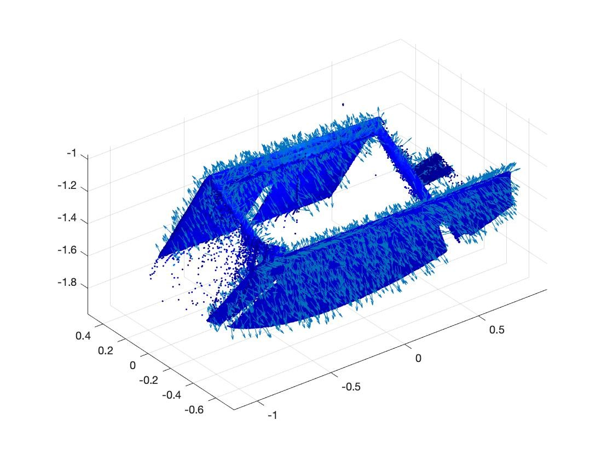**pc** **=**
**pcread('mesa.ply');** **normals** **=** **pcnormals(pc);**
**pcshow(pc);**

**x** **=** **pc.Location(1:100:end,1);** **y** **=**
**pc.Location(1:100:end,2);** **z** **=** **pc.Location(1:100:end,3);**
**u** **=** **normals(1:100:end,1);**

**v** **=** **normals(1:100:end,2);** **w** **=**
**normals(1:100:end,3);** **hold** **on** **quiver3(x,y,z,u,v,w,**
**2);** **hold** **off**

> Arturo de la Escalera Percepción 3D 17
>
>  style="width:1.60157in;height:0.51457in" />**índice**

**Leer** **y** **escribir** **nubes** **de** **puntos** **Mallas**

**Preprocesamiento** **Encontrar** **un** **plano**

**Funciones** **para** **encontrar** **objetos** **Segmentación**
**por** **distancia**

> Arturo de la Escalera Percepción 3D 18
>
>  style="width:1.60157in;height:0.51457in" />**Encontrar** **un**
> **plano**

model = pcfitplane(ptCloudIn,maxDistance) M-estimator SAmple Consensus
(MSAC)

model = pcfitplane(ptCloudIn,maxDistance,referenceVector)

model = pcfitplane(ptCloudIn,maxDistance,referenceVector,maxAngularDist)
\[model,inlierIndices,outlierIndices\] = pcfitplane(ptCloudIn,maxDist)

\[**\_\_\_**,meanError\] = pcfitplane(ptCloudIn,maxDistance)
\[**\_\_\_**\] = pcfitplane(ptCloudIn,maxDistance,Name,Value)

> Arturo de la Escalera Percepción 3D 19
>
>  style="width:1.60157in;height:0.51457in" />**Encontrar** **un**
> **plano**

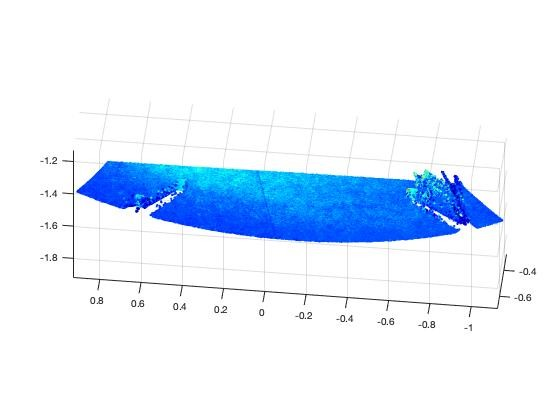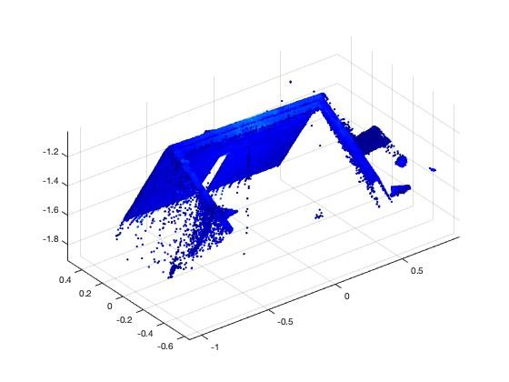**\>\>**
**\[plano,inlierIndices,outlierIndices\]** **=**
**pcfitplane(pc,0.05);** **\>\>** **plane1** **=**
**select(pc,inlierIndices);**

**\>\>** **pcshow(plane1);**

**\>\>** **resto** **=** **select(pc,outlierIndices);** **\>\>**
**pcshow(resto);**

**\>\>** **pcshow(pc);** **\>\>** **pcshow(resto);**

**\>\>** **\[plano,inlierIndices,outlierIndices\]** **=**
**pcfitplane(resto,0.05);** **\>\>** **plane2** **=**
**select(resto,inlierIndices);**

**\>\>** **pcshow(plane2);**

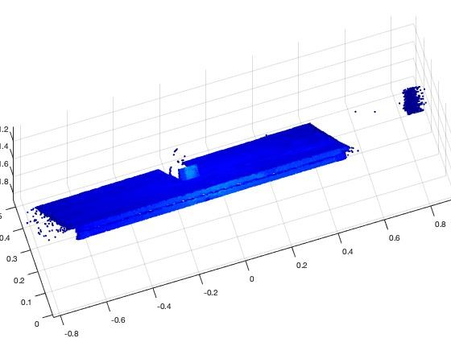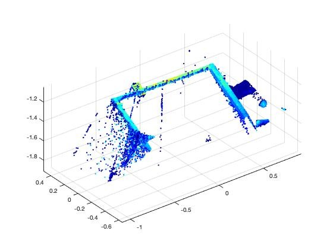**\>\>** **resto2** **=**
**select(resto,outlierIndices);** **\>\>** **pcshow(resto2);**

> Arturo de la Escalera Percepción 3D 20
>
>  style="width:1.60157in;height:0.51457in" />**Detectar** **suelo**
> **de**
> **calle1.pcd**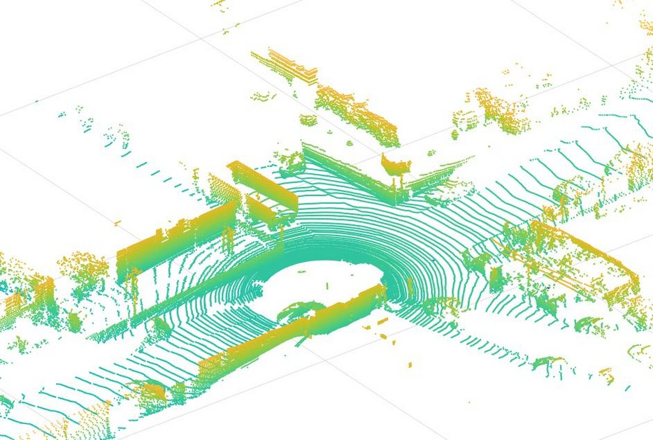

**\>\>** **vec=\[0** **0** **1\];**

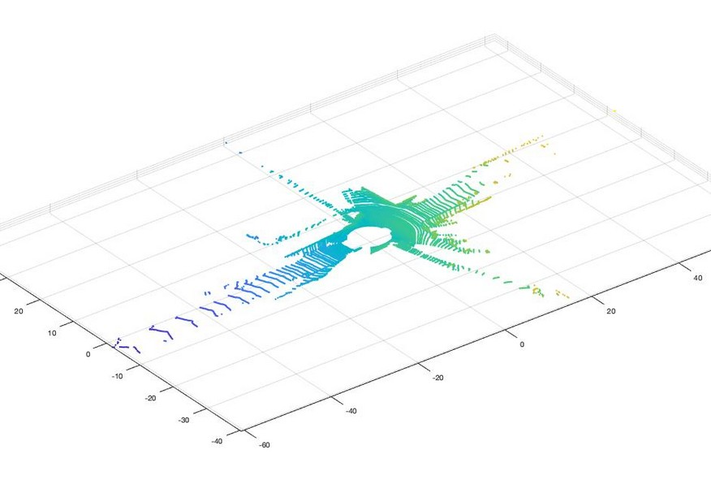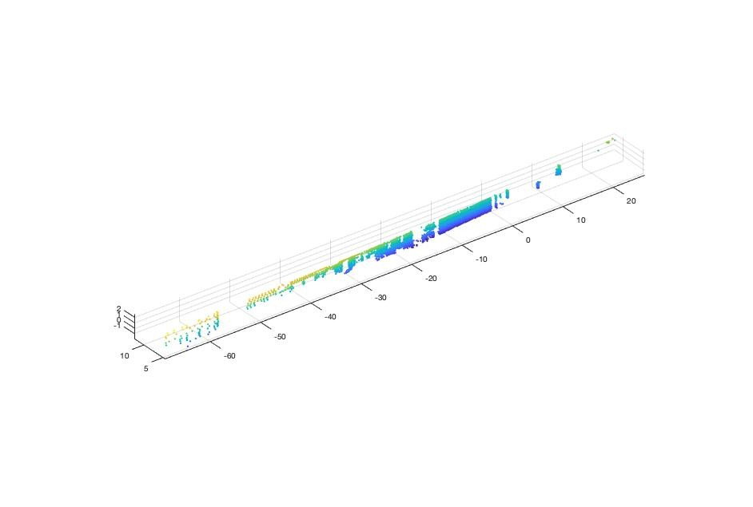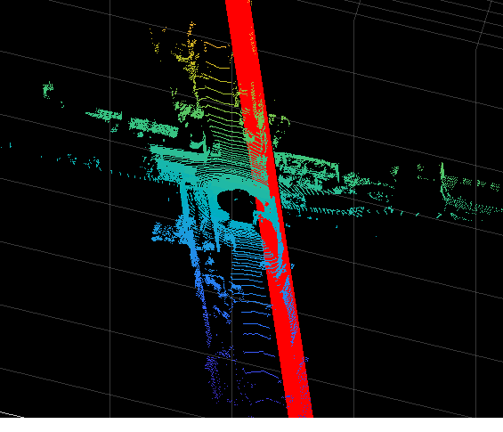**\>\>**
**\[plano1,inlierIndices1,outlierIndices1\]** **=**
**pcfitplane(pc,0.2,vec);** **\>\>** **Superficie1** **=**
**select(pc,inlierIndices1);**

**pcshow(pc);** **hold** **on**

**plot(plano1);**

> Arturo de la Escalera Percepción 3D 21
>
>  style="width:1.60157in;height:0.51457in" />**índice**

**Leer** **y** **escribir** **nubes** **de** **puntos** **Mallas**

**Preprocesamiento** **Encontrar** **un** **plano**

**Funciones** **para** **encontrar** **objetos** **Segmentación**
**por** **distancia**

> Arturo de la Escalera Percepción 3D 22
>
>  style="width:1.60157in;height:0.51457in" />**pcfitcylinder**

**model** **=** **pcfitcylinder(ptCloudIn,maxDistance)**

**model** **=** **pcfitcylinder(ptCloudIn,maxDistance,referenceVector)**

**model** **=**
**pcfitcylinder(ptCloudIn,maxDistance,referenceVector,maxAngularDista**
**nce)**

**\[model,inlierIndices,outlierIndices\]** **=**
**pcfitcylinder(ptCloudIn,maxDistance)**

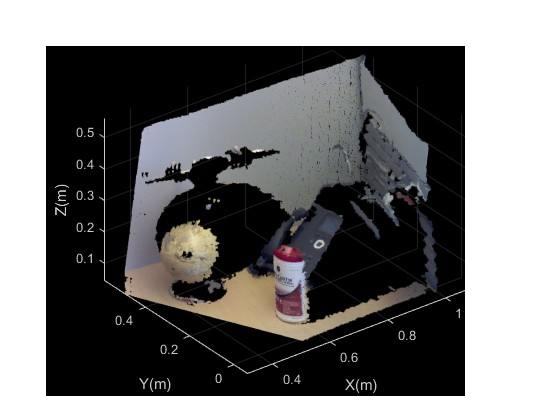 **\[\_\_\_,meanError\]**
**=** **pcfitcylinder(ptCloudIn,maxDistance)**

**\[\_\_\_\]** **=** **pcfitcylinder(\_\_\_,Name,Value)**

> objetos.ply
>
> Arturo de la Escalera Percepción 3D 23
>
>  style="width:1.60157in;height:0.51457in" />**pcfitsphere**

model = pcfitsphere(ptCloudIn,maxDistance)

\[model,inlierIndices,outlierIndices\] =
pcfitsphere(ptCloudIn,maxDistance)

\[**\_\_\_**,meanError\] = pcfitsphere(ptCloudIn,maxDistance)
\[**\_\_\_**\] = pcfitsphere(**\_\_\_**,Name,Value)

>  style="width:5.36654in;height:4.0256in" />objetos.ply
>
> Arturo de la Escalera Percepción 3D 24
>
>  style="width:1.60157in;height:0.51457in" />**índice**

**Leer** **y** **escribir** **nubes** **de** **puntos** **Mallas**

**Preprocesamiento** **Encontrar** **un** **plano**

**Funciones** **para** **encontrar** **objetos** **Segmentación**
**por** **distancia**

> Arturo de la Escalera Percepción 3D 25

**Segmentación** **por**
**distancia**

> **labels** **=** **pcsegdist(ptCloud,minDistance)**
>
> **\[labels,numClusters\]** **=** **pcsegdist(ptCloud,minDistance)**
>
> 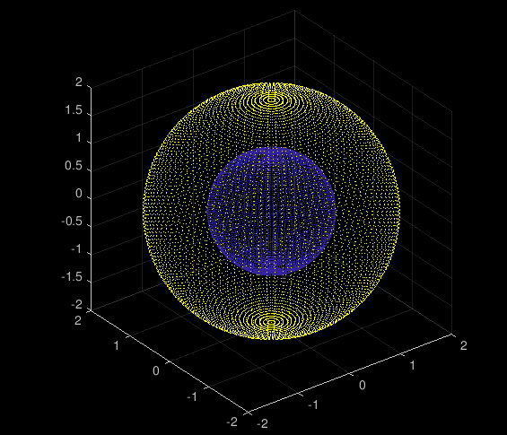 style="width:2.8433in;height:2.44094in" />**pc=pcread("esferas_2.ply");**
> **pcshow(pc);**
>
> **minDistance** **=** **0.5;**
>
> **\[labels,numClusters\]** **=** **pcsegdist(pc,minDistance);**
> **pcshow(pc.Location,labels);**
>
> 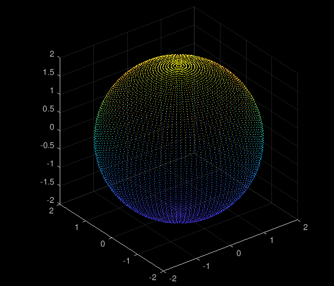 style="width:2.8433in;height:2.44056in" />**pc1** **=**
> **select(pc,find(labels** **==** **1));** **pcshow(pc1);**
>
> **pc1** **=** **select(pc,find(labels** **==** **2));**
> **pcshow(pc1);**
>
> Arturo de la Escalera Percepción 3D 26

**Segmentación** **por**
**distancia**

> Arturo de la Escalera Percepción 3D 27
