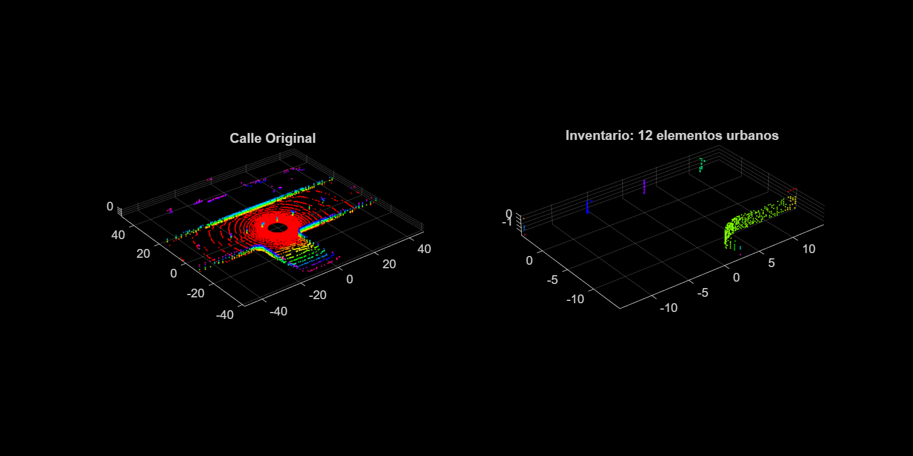

# Desafío 2: Inventario Urbano

Este directorio contiene la resolución al segundo ejercicio final propuesto por el profesor de Percepción 3D.

## Objetivo
El objetivo final es aislar y contar automáticamente el número de entidades verticales presentes en una calle (árboles, coches, peatones, etc.) a partir de la nube exterior `calle1.pcd`. Para lograrlo debemos aplicar filtrados y descartar el ruido del suelo, utilizando luego segmentaciones heurísticas para agrupar el enjambre de nubes huérfanas en objetos independientes.

## Estrategia Algorítmica Aplicada (`inventario_urbano.m`)
La tubería aplicada obedece paso por paso a tus directrices:

1. **Slider Simulado (`findPointsInROI`)**: Hemos programado unos límites espaciales (como actúan los sliders gráficos) de +-15 metros a la redonda para ahorrarnos procesar fachadas extremas y reducir en gran medida la carga geométrica en algoritmos posteriores.
2. **Erradicación del Suelo (`pcfitplane`)**: Obligamos a descartar la carretera/acera enviándole a MATLAB explícitamente el vector perpendicular `[0,0,1]`. A partir de aquí continuamos el camino únicamente usando el sobrante.
3. **Mapeado Físico (`pcsegdist`)**: Como un coche o un árbol son formas totalmente orgánicas/irregulares, buscarlos con MSAC sería desastroso. Se emplea el agrupamiento espacial. Establecemos una separación de `0.6` metros; cualquier aglomeración de puntos separada de otra por más de esa distancia es tratada como un objeto del inventario distinto. Devuelve el número final de la cuenta.

### Resultado Esperado
Al ejecutar desde la Terminal/Command Window el fichero en MATLAB se imprimirá de golpe el conteo estadístico total de *Clusters/Objetos* detectados en texto plano; y, en los gráficos, todos esos elementos quedarán teñidos de colores discordantes visualizando su agrupación matemática.

