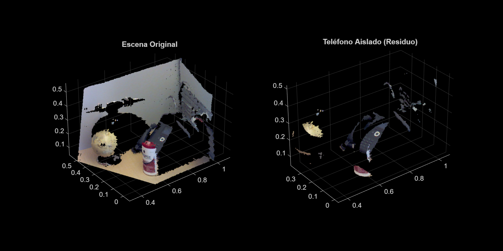

# Desafío 1: Aislar el Teléfono

Este directorio contiene la resolución al primer ejercicio final propuesto por el profesor de Percepción 3D.

## Objetivo
Dada la nube de puntos principal (`objetos.ply`), el problema a resolver demanda **eliminar la geometría intrusa progresivamente** (las dos paredes, el suelo, la esfera y el cilindro) para que computacionalmente al final solo nos quede la "nube irregular" del teléfono que no encaja en ninguna matemática perfecta.

## Estrategia Algorítmica Aplicada (`aislar_telefono.m`)
Dado que se trata de un problema de aislamiento por exclusión, planteamos una tubería (*pipeline*) que en vez de fijarse en sus *inliers* (puntos coincidentes), se queda siempre con sus *outliers* (todo lo demás):

1. `pcfitplane`: Disparado 3 iteraciones seguidas quedándose con el `resto` (se come el suelo y ambas paredes que lo rodean).
2. `pcfitcylinder`: Disparado sobre el resto escaneando y fulminando la taza/cilindro.
3. `pcfitsphere`: Disparado sobre el último resto para purgar la esféra.
4. Extracción de lo que queda y visualización comparativa de dicho "residuo".

### Resultado Esperado
Al ejecutar el código y generar el modelo de descarte RANSAC continuo, la gráfica renderizada evidenciará la original vs final.

