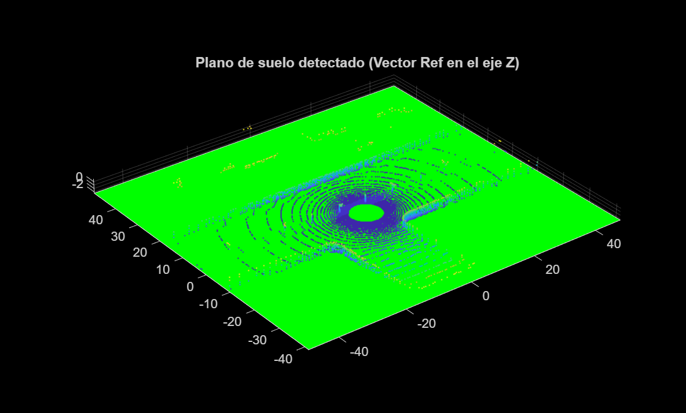

# Práctica 1: Percepción 3D

Esta práctica está dedicada al **Preprocesamiento y la Segmentación de Nubes de Puntos (Point Clouds)** en MATLAB. 

## Objetivos
* **Lectura y visualización** de formatos estándar (`.ply`, `.pcd`) usando `pcread` y `pcshow`.
* **Procesamiento de datos**:
  * Recorte por región de interés (ROI).
  * Reducción de puntos (Downsampling, `pcdownsample`).
  * Eliminación de ruido (Denoising, `pcdenoise`).
* **Cálculo de normales** de las superficies.
* **Ajustes Geométricos (Fitting)**: Encontrar geometrías puras (planos, esferas, cilindros) en la nube mediante algoritmos de RANSAC/MSAC.
* **Segmentación de objetos** en el espacio analizando las distancias entre conjuntos usando `pcsegdist`.

## Requisitos y Configuración de MATLAB
Esta práctica se basa exclusivamente en MATLAB (aunque la carpeta de recursos ponga "PySNP"), por lo que requerirás instalar algunos complementos (Toolboxes) desde la pestaña "Home" -> "Add-Ons":
- **Computer Vision Toolbox**
- **Lidar Toolbox**

## Scripts Desarrollados y Resultados
Los datos en bruto (`mesa.ply`, `calle1.pcd`, etc.) se encuentran en la subcarpeta `Practica 1`. A continuación se detallan los scripts generados hasta el momento:

### 1. Visualización Automática (`a_Visualizar_PLY.m`)
Este script recorre los directorios locales automatizando la carga y visualización de todas las nubes de puntos (`.ply`) disponibles.

### 2. Recorte por Región de Interés (`b_ejercicio_roi.m`)
Implementación de recorte en una nube de puntos mediante la función `findPointsInROI` definiendo límites en 3D. El script resalta en verde los puntos pertenecientes a la Región de Interés.

### 3. Disminución de Resolución - Downsampling (`c_ejercicio_downsample.m`)
Demostración y comparativa de las 3 estrategias del método `pcdownsample`: *Random*, *Grid Average* y *Non-uniform*.  

### 4. Eliminación de Outliers - Denoising (`d_ejercicio_denoise.m`)
Aplicación del filtro `pcdenoise` para limpiar puntos ruidosos anómalos. El script compara el uso de la función con sus parámetros por defecto frente a una configuración más exigente (Threshold: 0.5, NearestNeighbors: 20).

### 5. Cálculo y Representación de Normales (`e_ejercicio_normales.m`)
Para cada punto, la función `pcnormals` ajusta un plano local estimando la perpendicular (vector normal) de dicho fragmento de superficie. El script procesa esto y usa la función `quiver3` para superponer una representación de las flechas (vectores) muestreando 1 de cada 100 puntos para evitar saturar el área visual.

### 6. Ajuste Geométrico de Planos (`f_ejercicio_plano.m`)
Búsqueda de planos matemáticos utilizando el algoritmo iterativo MSAC mediante la función `pcfitplane`. El script realiza y compara dos enfoques:
1. **Búsqueda ciega o iterativa:** Encuentra el plano de mayor tamaño en un archivo, separa e ignora esos puntos, y repite la búsqueda de un segundo plano en los puntos restantes que habían sido descartados (`mesa.ply`).
2. **Búsqueda guiada por vector:** Usa un vector de orientación de referencia `[0,0,1]` en el espacio para forzar la búsqueda matemática de planos solamente horizontales, logrando detectar perfectamente el asfalto del suelo exterior (`calle1.pcd`).

> **Nota:** Las imágenes de esta sección se generan y guardan automáticamente en la carpeta `images/` al ejecutar los respectivos archivos `.m` en tu ventana de MATLAB.
