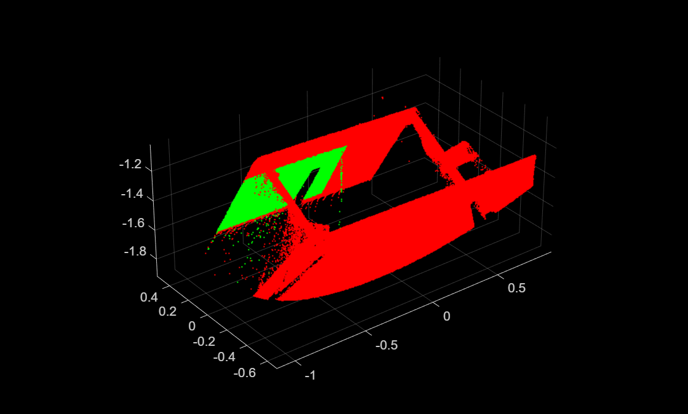
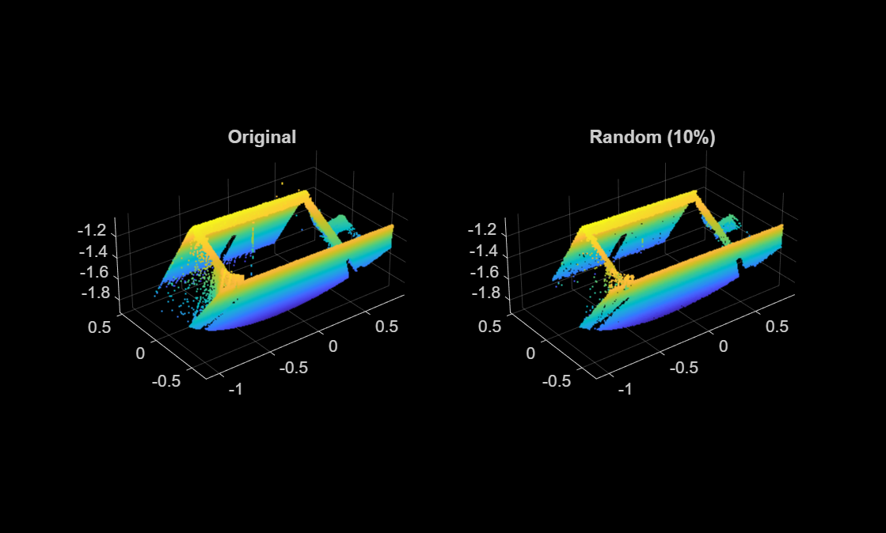
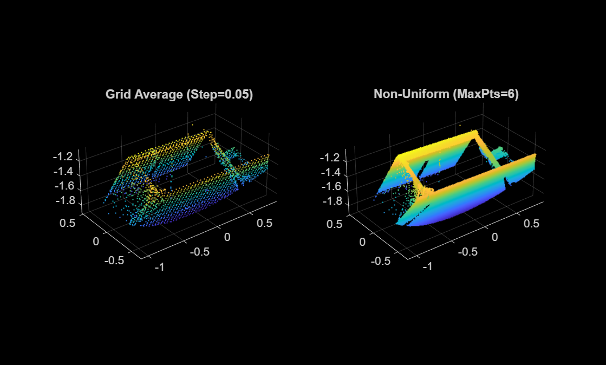
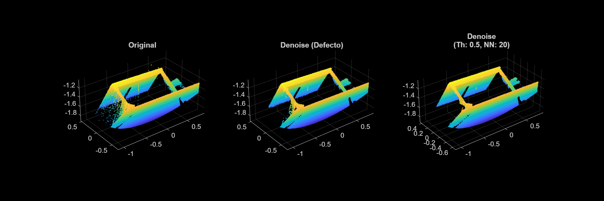
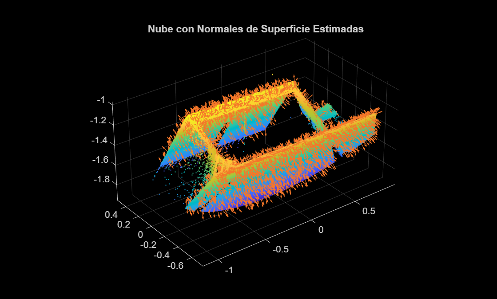
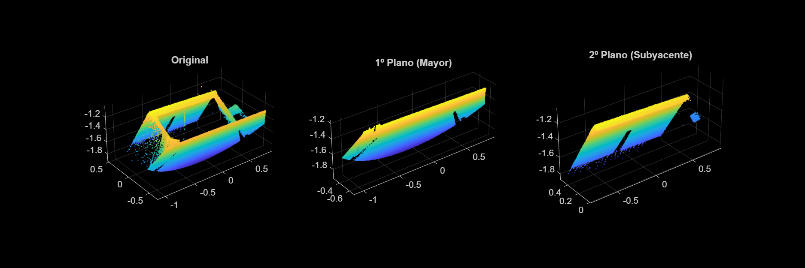
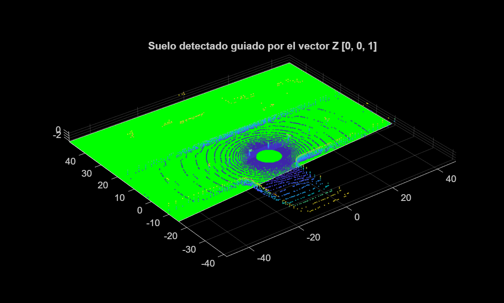
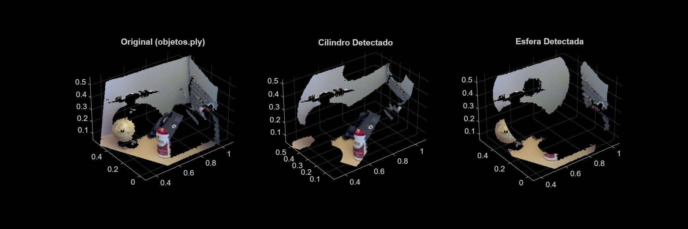
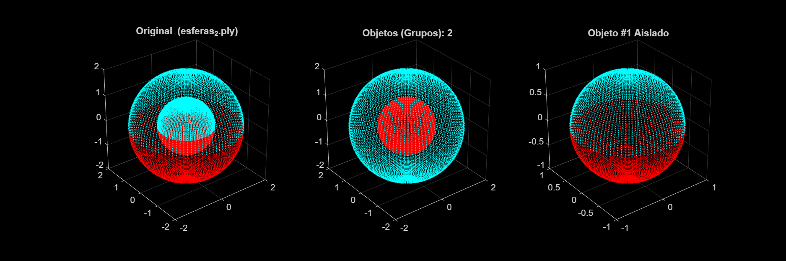

# Práctica 1: Percepción 3D

Esta práctica está dedicada al **Preprocesamiento y la Segmentación de Nubes de Puntos (Point Clouds)** en MATLAB. 

## Objetivos
* **Lectura y visualización** de formatos estándar (`.ply`, `.pcd`) usando `pcread` y `pcshow`.
* **Procesamiento de datos**:
  * Recorte por región de interés (ROI).
  * Reducción de puntos (Downsampling, `pcdownsample`).
  * Eliminación de ruido (Denoising, `pcdenoise`).
* **Cálculo de normales** de las superficies.
* **Ajustes Geométricos (Fitting)**: Encontrar geometrías puras (planos, esferas, cilindros) en la nube mediante algoritmos de RANSAC/MSAC.
* **Segmentación de objetos** en el espacio analizando las distancias entre conjuntos usando `pcsegdist`.

## Requisitos y Configuración de MATLAB
Esta práctica se basa exclusivamente en MATLAB (aunque la carpeta de recursos ponga "PySNP"), por lo que requerirás instalar algunos complementos (Toolboxes) desde la pestaña "Home" -> "Add-Ons":
- **Computer Vision Toolbox**
- **Lidar Toolbox**

## Scripts Desarrollados y Resultados
Los datos en bruto (`mesa.ply`, `calle1.pcd`, etc.) se encuentran en la subcarpeta `Practica 1`. A continuación se detallan los scripts generados hasta el momento:

### 1. Visualización Automática (`a_Visualizar_PLY.m`)
Este script recorre los directorios locales automatizando la carga y visualización de todas las nubes de puntos (`.ply`) disponibles.

### 2. Recorte por Región de Interés (`b_ejercicio_roi.m`)
Implementación de recorte en una nube de puntos mediante la función `findPointsInROI` definiendo límites en 3D. El script resalta en verde los puntos pertenecientes a la Región de Interés.

### 3. Disminución de Resolución - Downsampling (`c_ejercicio_downsample.m`)
Demostración y comparativa de las 3 estrategias del método `pcdownsample`: *Random*, *Grid Average* y *Non-uniform*.  

### 4. Eliminación de Outliers - Denoising (`d_ejercicio_denoise.m`)
Aplicación del filtro `pcdenoise` para limpiar puntos ruidosos anómalos. El script compara el uso de la función con sus parámetros por defecto frente a una configuración más exigente (Threshold: 0.5, NearestNeighbors: 20).

### 5. Cálculo y Representación de Normales (`e_ejercicio_normales.m`)
Para cada punto, la función `pcnormals` ajusta un plano local estimando la perpendicular (vector normal) de dicho fragmento de superficie. El script procesa esto y usa la función `quiver3` para superponer una representación de las flechas (vectores) muestreando 1 de cada 100 puntos para evitar saturar el área visual.

### 6. Ajuste Geométrico de Planos Iterativos (`f_ejercicio_plano.m`)
Búsqueda de planos utilizando el algoritmo estadístico MSAC (`pcfitplane`). El script ejecuta una **búsqueda ciega o iterativa** en la nube de puntos (`mesa.ply`): localiza el plano dominante, extrae sus puntos, aisla el "resto" de la escena, y repite la operación matemática para encontrar el segundo plano más predominante subyacente.

### 7. Detección de Suelo Asfáltico (`g_ejercicio_suelo.m`)
Una variante del ajuste de planos sobre nubes captadas en exteriores (`calle1.pcd`). En lugar de realizar una búsqueda ciega, el algoritmo reciba el **vector director cartesiano `[0,0,1]`** de la perpendicular local. Gracias a esto y a una tolerancia incrementada de `0.2` frente a imperfecciones, el script logra detectar matemáticamente el suelo frente al resto del entorno.

### 8. Funciones para encontrar Objetos (`h_ejercicio_objetos.m`)
Igual que podemos aproximar superficies lisas o planos, el uso de los algoritmos RANSAC/MSAC junto a la familia de funciones geométricas de la Toolbox nos permite encajar volúmenes sobre la nube de puntos. El script procesa el espacio tridimensional del archivo `objetos.ply` intentando detectar y encajar de manera autónoma primitivas en 3D correspondientes a:
* **Un cilindro** (ej: tuberías, tazas) mediante `pcfitcylinder`.
* **Una esfera** (ej: balones, esferas de calibración) mediante `pcfitsphere`.
*(Nota: Tal y como ilustran las diapositivas, las funciones se aplican directamente sobre la nube cruda. Dependiendo de la topografía, el algoritmo puede confundir la inmensa cantidad de puntos del suelo como ser caras gigantes planas de esos objetos).*

### 9. Segmentación por Distancia Física (`i_ejercicio_segmentacion.m`)
Para diferenciar qué puntos pertenecen a qué objetos basándonos únicamente en sus huecos (sin importar su forma o geometría como antes), se utiliza la función agrupadora `pcsegdist`.
El algoritmo busca y separa todos los grupos de puntos que posean un vacío intermedio superior a la métrica fijada (`minDistance = 0.5`). Esto nos devuelve de manera automática un mapeado (`labels`) que podemos utilizar para colorear cada clúster y aislar computacionalmente los objetos que queramos para procesarlos (`esferas_2.ply`).

> **Nota:** Las imágenes de esta sección se generan y guardan automáticamente en la carpeta `images/` al ejecutar los respectivos archivos `.m` en tu ventana de MATLAB.
