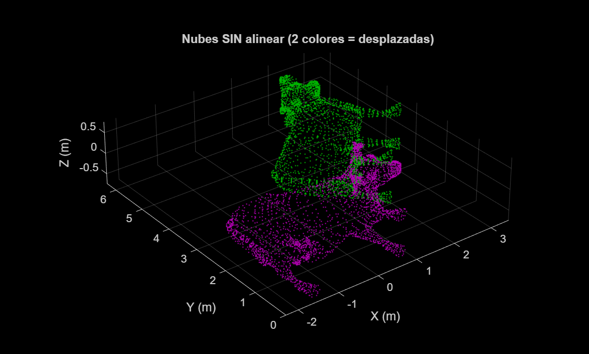
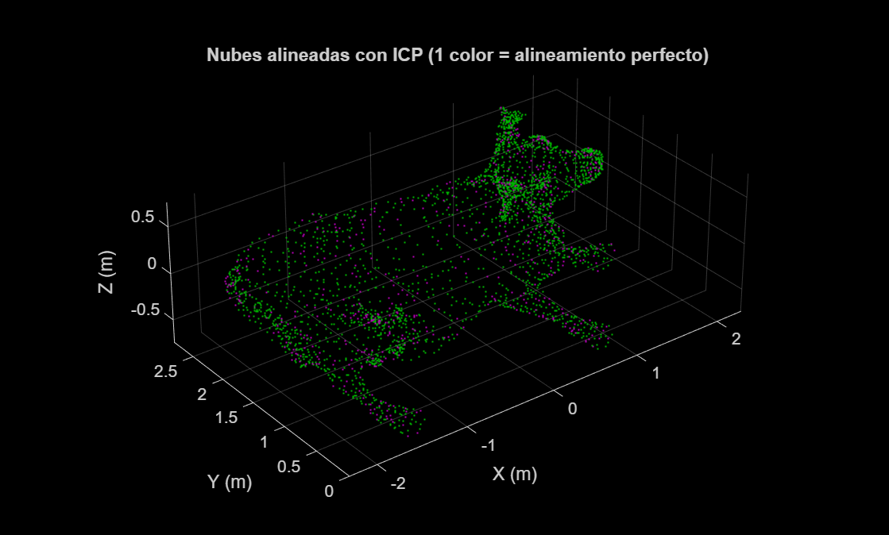
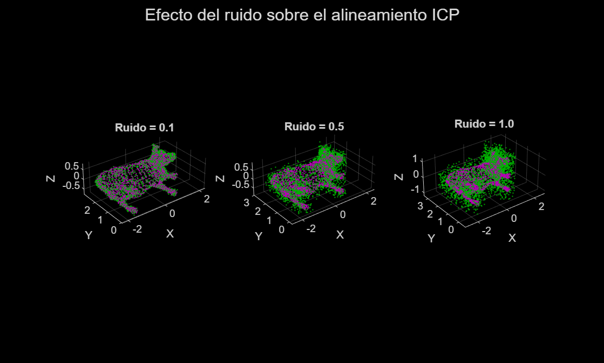
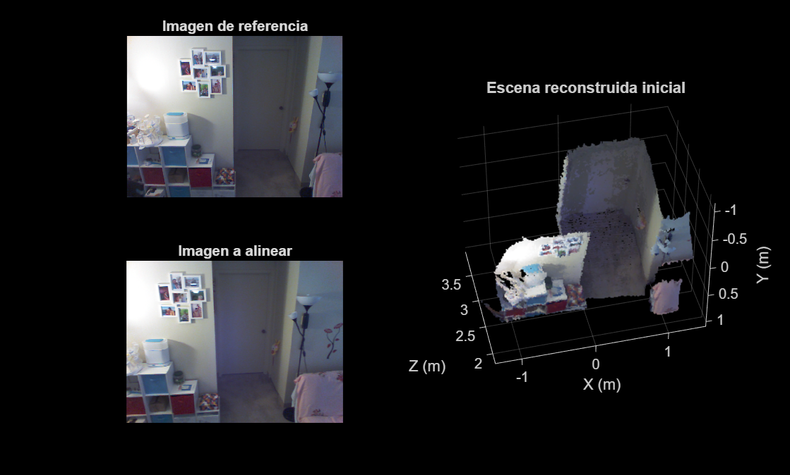
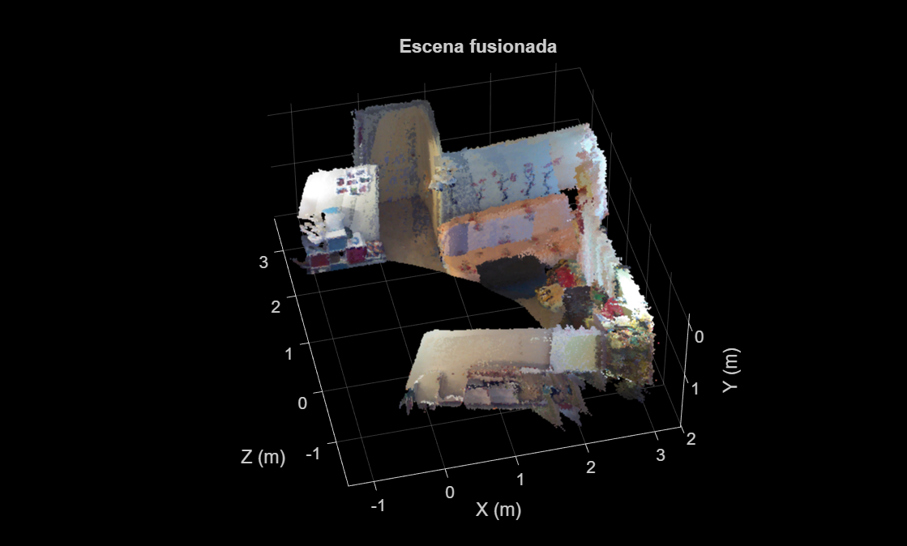

# Práctica 2: Percepción 3D

Esta práctica está dedicada a la **Reconstrucción 3D de Escenas a partir de Nubes de Puntos** en MATLAB, abordando el registro automático entre capturas y la fusión incremental de secuencias RGB-D.

## Objetivos
* **Transformaciones geométricas 3D**: Construir matrices de transformación homogéneas 4×4 que combinan traslación, rotación y escala, y aplicarlas con `pctransform`.
* **Registro de nubes de puntos (ICP)**: Alinear automáticamente dos nubes con `pcregistericp`, comprendiendo el algoritmo *Iterative Closest Point* y sus métricas (`pointToPlane`, `pointToPoint`).
* **Fusión de nubes**: Combinar múltiples capturas en una única nube coherente con `pcmerge`.
* **Reconstrucción incremental**: Encadenar transformaciones acumuladas para llevar una secuencia entera de nubes RGB-D al sistema de coordenadas inicial.

## Requisitos y Configuración de MATLAB
Al igual que en la Práctica 1, se necesitan los siguientes complementos instalados desde "Home" → "Add-Ons":
- **Computer Vision Toolbox**
- **Lidar Toolbox**

## Scripts Desarrollados y Resultados

Los datos en bruto (`cow.ply`, `livingRoom.mat`) se encuentran en la subcarpeta `Clase5-Rec3D-Pract2/Clase5-Rec3D-Pract2/`.

### 1. Alineamiento de dos nubes de puntos (`alinear_dos_nubes_resolver.m`)

Ejercicio introductorio al registro 3D sobre el modelo de vaca (`cow.ply`). El flujo de trabajo es:

1. Se carga la nube original `nube1` y se le aplica una transformación conocida — traslación de (3, 3, 0) y rotación de 45° en Z — generando `nube2`. Nota importante: en MATLAB la traslación ocupa la **última fila** de la matriz 4×4, al contrario que en la notación matemática estándar.
2. `pcshowpair` muestra ambas nubes en colores distintos, evidenciando el desplazamiento.
3. `pcregistericp` ejecuta el algoritmo ICP con métrica `pointToPlane`: busca iterativamente la transformación que minimiza la distancia entre cada punto de `nube2` y el plano tangente de su vecino más cercano en `nube1`.
4. Se verifica la precisión comparando la matriz de transformación original con la inversa calculada: deben ser numéricamente casi idénticas.
5. Por último, se prueba el efecto del ruido sobre ICP con niveles 0.1, 0.5 y 1.0 usando la función auxiliar `add_noise_to_pointCloud`.

**Nubes sin alinear** (dos colores = desplazadas):



**Nubes alineadas con ICP** (un color = alineamiento perfecto):



**Efecto del ruido sobre ICP** (de izquierda a derecha: ruido 0.1, 0.5, 1.0):



---

### 2. Reconstrucción de escena RGB-D (`reconstruccion_escena_resolver.m`)

Ejercicio de reconstrucción de una sala completa a partir de una secuencia de capturas de un sensor Kinect, almacenadas en `livingRoom.mat` como un *cell array* de nubes con color.

#### Parte A — Fusión de dos nubes RGB-D

Las dos primeras nubes de la secuencia se alinean y fusionan:

1. Ambas se reducen con `pcdownsample` (voxel de 10 cm) para acelerar el ICP sin perder la capacidad de encontrar correspondencias.
2. `pcregistericp` con `'Metric','pointToPlane'` calcula la transformación para llevar la segunda nube al sistema de referencia de la primera.
3. La transformación se aplica a la nube **completa** (sin reducir) para conservar el detalle de color.
4. `pcmerge` con voxel de 1.5 cm fusiona ambas nubes en una sola, resolviendo los solapes.

La figura muestra la imagen RGB de cada captura y la escena 3D resultado de la fusión:



#### Parte B — Reconstrucción incremental de la secuencia completa

El mismo proceso se extiende al resto de la secuencia mediante un bucle. La clave técnica es la **acumulación de transformaciones**:

```matlab
transformacion_acumulada = affine3d(transformacion.T * transformacion_acumulada.T);
```

Cada nube se alinea contra la inmediatamente anterior (mayor solapamiento), pero la transformación que se aplica es el **producto acumulado** de todas las parciales desde el inicio. Esto garantiza que todas las nubes quedan en el mismo sistema de coordenadas que la nube inicial, no solo en el de la anterior. Al terminar el bucle se aplica una rotación corrección de −π/10 radianes en X para compensar que el Kinect apuntaba ligeramente hacia abajo.

**Escena final reconstruida** (sala completa):



---

> **Nota:** Las imágenes incrustadas se generan y guardan automáticamente en la carpeta `images/` al ejecutar los archivos `.m` en MATLAB. La carpeta se crea si no existe.
